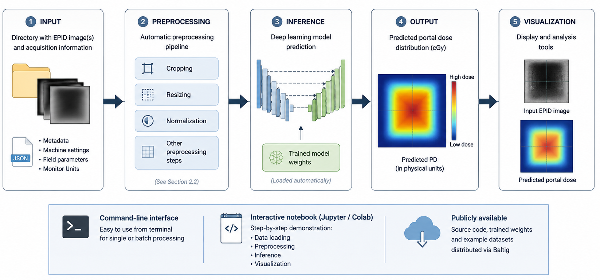
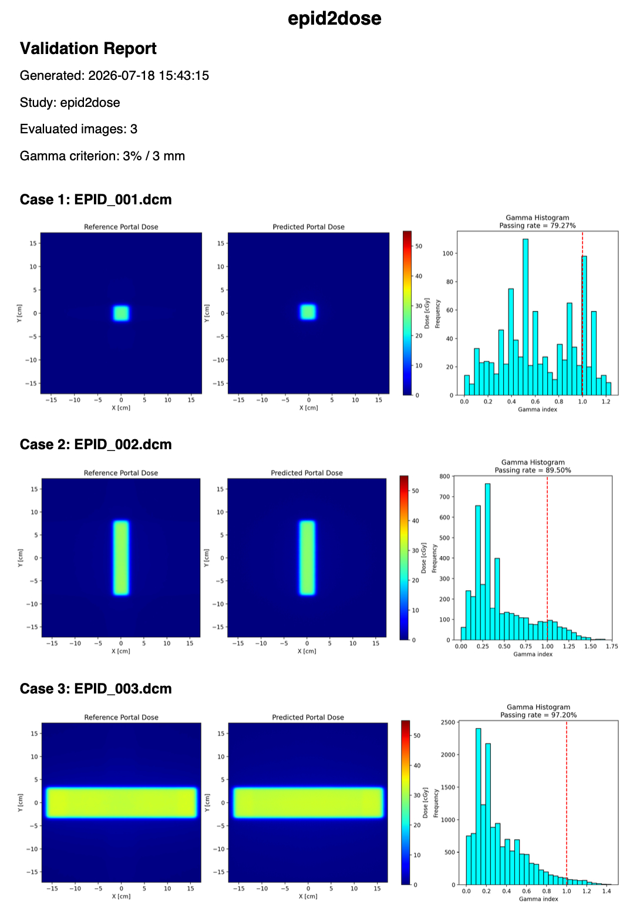

# epid2dose


**epid2dose** is an open-source deep learning framework for predicting two-dimensional **Portal Dose (PD)** distributions directly from transit **Electronic Portal Imaging Device (EPID)** images.

The software implements the inference pipeline described in:

> **Marini L. et al.** *Improving patient treatment accuracy using transit dosimetry with Electronic Portal Imaging Device images and deep learning*. Physics and Imaging in Radiation Oncology, 39, 100966 (2026).

---

## Overview

Conventional EPID-based dosimetry requires multiple detector-specific calibration and correction procedures before estimating the corresponding Portal Dose distribution.

**epid2dose** replaces this workflow with a single deep learning model that directly predicts the Portal Dose from the measured transit EPID image.

The package provides:

- automatic EPID preprocessing;
- Portal Dose prediction using an ensemble of trained U-Net models;
- optional gamma-index validation against reference Portal Dose distributions;
- automatic PDF report generation.

<p align="center">

</p>

---

# Repository structure

```text
epid2dose
├── LICENSE
├── README.md
├── docs
├── examples
│   ├── input
│   │   ├── EPID_001.dcm
│   │   ├── EPID_002.dcm
│   │   └── EPID_003.dcm
│   ├── output
│   │   ├── predictions
│   │   └── reports
│   └── reference
│       ├── PD_001.txt
│       ├── PD_002.txt
│       └── PD_003.txt
├── models
│   ├── unet.py
│   └── weights
│       ├── README.md
├── pd_prediction.py
├── requirements.txt
└── utils
    ├── __init__.py
    ├── constants.py
    ├── io.py
    ├── plotting.py
    ├── prediction.py
    ├── preprocessing.py
    └── report.py
```

where:

- **examples/input/** contains sample EPID DICOM images.
- **examples/reference/** contains reference Portal Dose distributions.
- **examples/output/** contains example predictions and validation reports.
- **models/** contains the U-Net architecture and trained weights.
- **utils/** contains preprocessing, inference, plotting, and reporting utilities.
- 
---

# Installation

Clone the repository

```bash
git clone https://github.com/lorenzomarini96/epid2dose.git

cd epid2dose
```

Create a virtual environment (recommended)

```bash
python -m venv .venv
```

Activate it

Linux / macOS

```bash
source .venv/bin/activate
```

Windows

```bash
.venv\Scripts\activate
```

Install the required packages

```bash
pip install -r requirements.txt
```

---

# Download trained weights

The trained network weights are distributed separately because they exceed GitHub file size limits.

Download the weights from:

**[(link here)](https://drive.google.com/drive/folders/1kV3Vw6ueXHsnLeENCj65CruUSFxBfPMC?usp=drive_link)**

and extract them inside

```text
models/weights/
```

The expected folder structure is

```text
models/
└── weights/
    └── cv_1/
        ├── model_1/
        ├── model_2/
        ├── model_3/
        ├── model_4/
        └── model_5/
```

---

# Example dataset

The repository contains a small example dataset:

```text
examples/
├── input/
│     EPID DICOM images
│
├── reference/
│     Portal Dose reference (.txt)
│
└── output/
```

---

# Running inference

Predict Portal Dose images

```bash
python pd_prediction.py \
-i examples/input \
-o examples/output
```

To additionally generate a gamma-index validation report

```bash
python pd_prediction.py \
-i examples/input \
-o examples/output \
--reference_dir examples/reference \
--report
```

---

# Output

The software automatically creates

```text
output/

├── predictions/
│     PD_*.npy
│
└── reports/
      prediction_overview.pdf
      validation_report.pdf
```

---

# Prediction overview

The generated prediction report contains the input EPID image together with the corresponding predicted Portal Dose.

<p align="center">

</p>

---

# Validation report

If reference Portal Dose distributions are available, the software automatically computes gamma-index analysis and generates a validation report.

The report includes

- reference Portal Dose;
- predicted Portal Dose;
- gamma-index histogram;
- gamma passing rates.

<p align="center">

</p>

---

# Requirements

The software has been tested using

```
tensorflow==2.16.2
numpy==1.26.4
scipy==1.14.1
h5py==3.12.1
matplotlib==3.10.0
opencv-python==4.10.0.84
pydicom==3.0.1
pymedphys==0.40.0
tqdm==4.67.1
fpdf2==2.8.7
```

Apple Silicon users may optionally install `tensorflow-metal` to enable GPU acceleration.

---

# Citation

If you use this software in your work, please cite

```bibtex
@article{MARINI2026100966,
title = {Improving patient treatment accuracy using transit dosimetry with Electronic Portal Imaging Device images and deep learning},
journal = {Physics and Imaging in Radiation Oncology},
volume = {39},
pages = {100966},
year = {2026},
doi = {https://doi.org/10.1016/j.phro.2026.100966},
author = {Lorenzo Marini and Carlotta Mozzi and Michele Avanzo and Francesca Lizzi and Icro Meattini and Giovanni Pirrone and Alessandra Retico and Emmanuel Uwitonze and Aafke Christine Kraan and Cinzia Talamonti}
}
```

---

# Acknowledgements

This software was developed during the **38th Cycle of the Italian National PhD Programme in Artificial Intelligence** at the **University of Pisa**, in collaboration with the **University of Florence**, as part of the **InTrEPID** research project.

I would like to express my deepest gratitude to **Dr. Francesca Lizzi** and **Dr. Aafke Christine Kraan** for their continuous supervision, insightful scientific guidance, and unwavering support throughout my PhD research.

I would also like to thank all collaborators who contributed to the development, validation, and clinical evaluation of the proposed methodology:

- Dr. Carlotta Mozzi
- Dr. Michele Avanzo
- Dr. Francesca Lizzi
- Prof. Icro Meattini
- Dr. Giovanni Pirrone
- Dr. Emmanuel Uwitonze
- Dr. Aafke Christine Kraan
- Prof. Cinzia Talamonti
- Dr. Alessandra Retico

The authors gratefully acknowledge the support of the **Department of Computer Science, University of Pisa**, the **INFN Pisa Division**, and, in particular, the **INFN Pisa Computing Centre** for providing the computational resources that made the training and validation of the deep learning models possible.

I also acknowledge the collaboration of the **Medical Physics Unit of Careggi University Hospital (Florence)** for supporting the experimental acquisition and clinical validation activities.

---

# License

This project is distributed under the MIT License.
